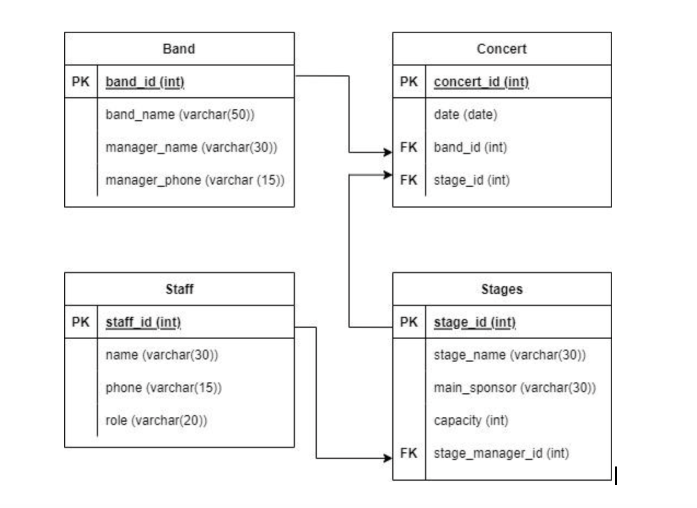

### SQL excercise

##### Codecool fest

The organizers of the CoolFeszt festival store the data of the performers in a SQL database in the structure specified by the model. The Staff table contains the data of the festival's employees, and the data of the performers were stored in the Band table. The Stages table contains information about the various stages and locations, and the Concert table contains the program, i.e. the bands performing at each location along with the date of the performance.
The Band, Staff and Stages tables are already available in a database, their creation is not part of the task.

**1. excercise**

Write an SQL statement that creates the Stages table based on the specified structure!
- When entering the foreign key, use the learned constraint.
- The default value of the capacity (main_sponsor) field should be SOKATKÖLTÜNKÁTÜRÁRA BANK.

**2. excercise**
Write an SQL statement that fills the Staff table with the following data:

| staff_id |  name |   phone   |       role       |
|----------|:-----:|:---------:|:----------------:|
| 1        | Vivi  | 123456789 | Logisztikus      |
| 2        | Barbi | 987654321 | Biztonsági főnök |

**3. excercise**
Write an SQL query that lists the records of the Stages table where the main sponsor (main_sponsor) is a bank whose name contains "bank". Sort the results in descending order according to capacity!

**4. excercise**
The organizers determine the capacity of the event based on the capacity of the festival's stages. Calculate the total number of people who can visit the festival by summing up the capacities in the Stages table!

**5. excercise**
Due to the great success, the organizers of the festival managed to sign Tommy (band_name) again. They definitely want him to perform on the Main Stage. By connecting the corresponding 3 tables, list the names of the bands that will perform on the Main Stage on 10/16/2023. In the query, every column of the Band table, except band_id,  should be visible, and in addition  the date and the name of the stage is selected as well.